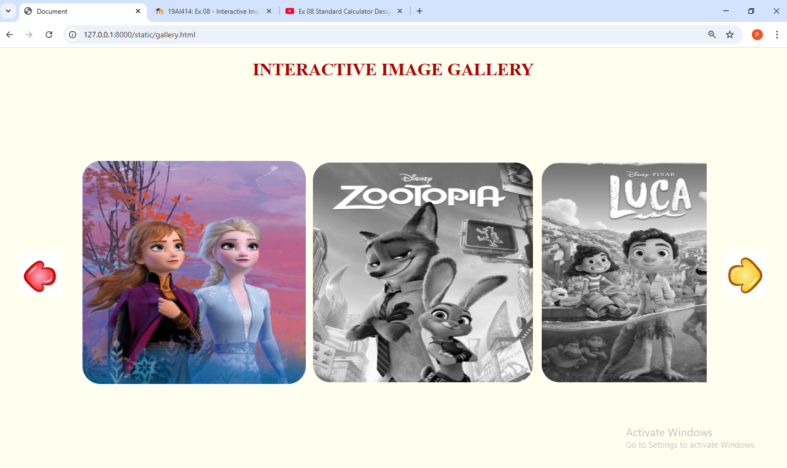

# Ex.08 Design of Interactive Image Gallery
# Date: 05/10/2025.
# AIM:
To design a web application for an inteactive image gallery with minimum five images.

# DESIGN STEPS:
## Step 1:
Clone the github repository and create Django admin interface.

## Step 2:
Change settings.py file to allow request from all hosts.

## Step 3:
Use CSS for positioning and styling.

## Step 4:
Write JavaScript program for implementing interactivity.

## Step 5:
Validate the HTML and CSS code.

## Step 6:
Publish the website in the given URL.

# PROGRAM :
```
gallery.html


<html lang="en">
<head>
    <meta charset="UTF-8">
    <meta name="viewport" content="width=device-width, initial-scale=1.0">
    <title>Document</title>
    <link rel="stylesheet" href="style.css">
</head>
<body>
    <h1> INTERACTIVE IMAGE GALLERY</h1>
    <div class="gallery-wrap">
        
        <div class="gallery">
    <div>
        <span> </span>
        <span> </span>
        <span> </span>
    </div>
        <div>
        <span> </span>
        <span> </span>
        <span> </span>
    </div>
    </div>
   
   </div> 
   <script>

      let scrollcontainer = document.querySelector(".gallery");
      let backBtn = document.getElementById("backBtn");
      let nextBtn = document.getElementById("nextBtn");

      scrollcontainer.addEventListener("wheel", (evt) =>{
        evt.preventDefault();
        scrollcontainer.scrollLeft += evt.deltaY;
        scrollcontainer.style.scrollBehavior="auto"
      })
      nextBtn.addEventListener("click", ()=> {
        scrollcontainer.style.scrollBehavior="smooth"
        scrollcontainer.scrollLeft +=500;
        
      })
      backBtn.addEventListener("click", ()=> {
        scrollcontainer.style.scrollBehavior="smooth"
        scrollcontainer.scrollLeft -=500;
        
      })

css styling 

.gallery{
    margin:0;
    display:flex;
  overflow-x: scroll;
}
.gallery div{
  
    display:grid;
    grid-template-columns:auto auto auto ;
    grid-gap: 20px;
    padding: 10px;
    flex: none;
}
h1{
    text-align: center;
    color:#B30000;
    font-size:40px;
}
body{
    background-color: ivory;
}
.gallery img{
    width:500px;
    height: 500px;
    border-radius:40px;
    filter: grayscale(100%);
    transition: transform 0.5s;
}
.gallery::-webkit-scrollbar
{
  display: none;
}
.gallery-wrap{
    display:flex;
    align-items: center;
    justify-content: center;
    margin:10% auto;   
}
#backBtn,#nextBtn{
    width: 100px;
    height: 100px;
    cursor:pointer;
    margin:40px;
}
.gallery img:hover{
    filter: grayscale(0%);
    cursor:pointer;
    transform: scale(1.1);
}
```
# OUTPUT:

<video controls src="image gallery.mp4" title="Title"></video>
# RESULT:
The program for designing an interactive image gallery using HTML, CSS and JavaScript is executed successfully.
